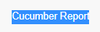
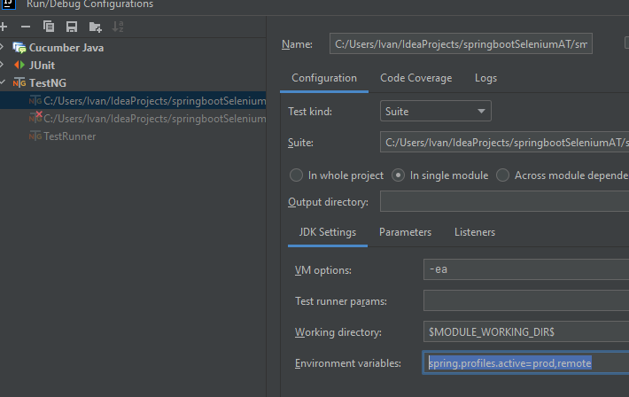
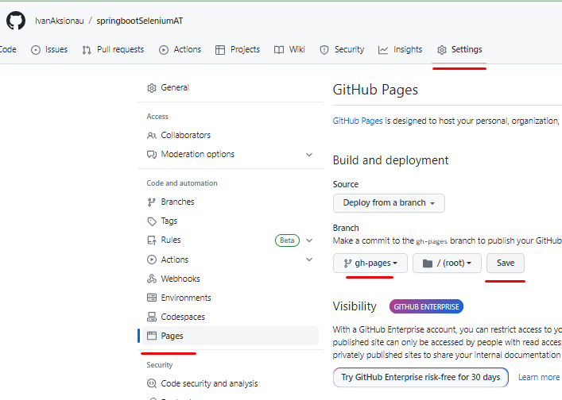
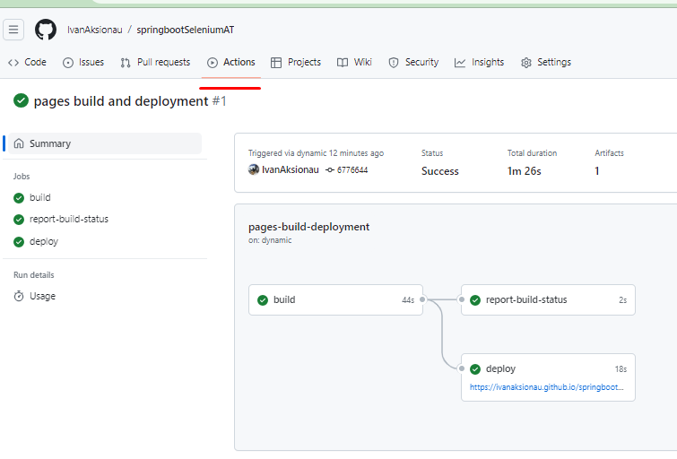

# SpringBoot/Selenium/Cucumber test framework for WEB application testing.

### Framework features:
* Test execution from xml files.
* Support of parallel test execution with Prototype Scope of spring framework.
* Various browsers support (Chrome, Firefox) from setup of 'spring.profiles.active=qa' in VM options/env variables of run configuration

### Test execution:
- Run command 'mvn clean install -D"driver.options=--headless,--remote-allow-origins=*"'
- Run directly any ...xml file located in the root folder.(ex. 'smoke-module_cucumber_runner.xml')

### Remote execution on Selenium grid
- To activate settings you should specify required 'properties' files for spring configuration - 'spring.profiles.active=prod,remote'
- You can also run tests from maven itself with 'mvn clean install -D"spring.profiles.active=prod,remote"'

  
- To increase the number of containers for parallel tests execution run 'docker-compose up -d --scale chrome=4'.
- You can check if hub was started by CURL GET http://localhost:4444/wd/hub/status

### CI integration:
- On each comment push to master branch/pull request tests will be executed with GitHub Actions. 
- You can check the results of the execution in the 'Actions' tab of the repository.
- Bellow you see how repository is set to deploy the report:

- You can access last generate report by https://ivanaksionau.github.io/springbootSeleniumAT/overview-features.html

### Useful links:
- About cucumber https://habr.com/ru/articles/332754/
- Spring bean scopes https://docs.spring.io/spring-framework/reference/core/beans/factory-scopes.html
- Cucumber parallel test execution https://cucumber.io/docs/guides/parallel-execution/?lang=java
- Cucumber reporting https://github.com/damianszczepanik/maven-cucumber-reporting
- cucumber-report-annotations-action https://github.com/deblockt/cucumber-report-annotations-action
- GitHub Pages https://pages.github.com/
- GitHub Action to deploy your static files to GitHub Page https://github.com/peaceiris/actions-gh-pages